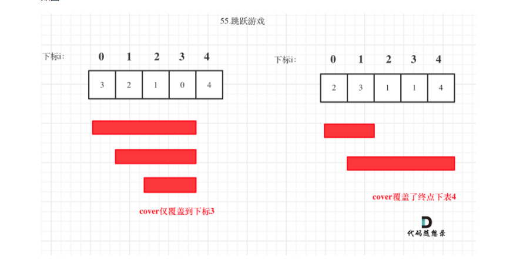

# 739. 每日温度（栈）

给定一个整数数组 temperatures ，表示每天的温度，返回一个数组 answer ，其中 answer[i] 是指在第 i 天之后，才会有更高的温度。如果气温在这之后都不会升高，请在该位置用 0 来代替。

**示例 1:**

```
输入: temperatures = [73,74,75,71,69,72,76,73]
输出: [1,1,4,2,1,1,0,0]
```

## 题解

一、首先可以用暴力解法，但可能会超时

二、

* 从最后一个元素开始，因为最后一个元素显然没有温度升高的可能，所以结果为0
* 从后往前判断，用res[]存放结果
  * 如果第i个元素的温度小于第i+1个元素的温度，则res[i] = 1
  * 如果第i个元素的温度大于或等于第i+1个元素的温度，此时如果暴力解法的话，就让第i个元素一直与后面的元素比较，但我们可以利用这个res数组
  * 如果此时res[i + 1]结果为0的话，则表示后面没有温度比第i+1个温度大了，但第i个温度比第i+1个温度大，则说明没有比第i个元素大的温度了，则res[i] = 0
  * 如果res[i + 1]不为0的话，此时比第i+1温度高的元素排在第i+1后res[i+1]位上，判断此时第i个温度与这个温度的大小，若第i个温度比较大的话，继续重复上一个动作，即再找到比这个温度大的温度；若第i个温度比较小的话，就找到了

* 具体代码

  ```js
  /**
   * @param {number[]} temperatures
   * @return {number[]}
   */
  var dailyTemperatures = function(temperatures) {
      const len = temperatures.length
      let t = 0
      let res = new Array(len)
      res[len - 1] = 0 // 先将最后一个结果设置为0
      for(let i = len-2; i >= 0; i--) {
        for(let j = i + 1; j < len; j += res[j]) {
            if(temperatures[i] < temperatures[j]) {
                res[i] = j - i  
                break
            } else if(!res[j]) {
                res[i] = 0
                break
            }
        }
      }
  
      return res
  };
  ```

  

# 102. 二叉树的层次遍历

给你二叉树的根节点 root ，返回其节点值的 层序遍历 。 （即逐层地，从左到右访问所有节点）。

示例 1：

```
输入：root = [3,9,20,null,null,15,7]
输出：[[3],[9,20],[15,7]]
```

## 题解

* 利用队列先入先出的特性
* 让每一层的节点入队列，之后判断队列的长度后弹出
* 利用先入先出特性，每个弹出的节点如果有子节点，会如队列，但不会在当时被弹出

```js
/**
 * @param {TreeNode} root
 * @return {number[][]}
 */
var levelOrder = function(root) {
    let queue = [], res = []
    if(root == null) {
        return res
    }
    queue.push(root)
    while(queue.length) {
        const len = queue.length
        const res1 = []
        for(let i = 0; i < len; i++) {
            const node = queue.unshift()
            res1.push(node.val)
            node.left && queue.push(node.left)
            node.right && queue.push(node.right)
        }
        res.push(res1)
    }
    
    return res
}
    
    
```

# 15. 三数之和

给你一个包含 n 个整数的数组 nums，判断 nums 中是否存在三个元素 a，b，c ，使得 a + b + c = 0 ？请你找出所有和为 0 且不重复的三元组。

注意：**答案中不可以包含重复的三元组**。

示例 1：

```
输入：nums = [-1,0,1,2,-1,-4]
输出：[[-1,-1,2],[-1,0,1]]
```

## 题解

### 能用哈希表吗？

**两数之和**

出于之前两数之和，就会往哈希表方面想，两数之和是判断数组中是否有两个数之和等于target，则可以利用哈希表，遍历一次数组，对于每个nums[i]，判断哈希表中有没有target-nums[i]，有的话就找到答案了，没有的话就将nums[i]设置为哈希值，这样依次迭代，就能找到答案

利用哈希表的话，两层for循环就能确定a, b了，剩下的就是找c了，也就是-a-b了，理论上利用哈希表找的话是可以的，但是题目中说到不能包含重复的三元组，但是利用哈希表就会存在元素重复出现的问题，**比如，现在a = -1, b = 2, 那就得找c = -1，但是目前哈希表已经有把a = -1这个设置为哈西值了，所以会找到-1，所以就出现了a这个元素出现两次的情况**，所以利用哈希表就得去重，但似乎很麻烦（我太菜了，学不会！）

综上，用哈希表不太适合

### 排序 + 双指针

* 先数组排序
* 两层for循环，确定a, b，再在剩余元素中查找c，
* 找c的过程是从数组最后一个元素遍历，循环至c的值小于或等于-(a + b)，此时因为数组是排序过的，所以大小关系是确定的
* 如果没有找到的话，即b之后的元素都会大于-(a + b) ，证明此时a必不可能会出现三数之后等于0的，因为a存在时，b和c取a后面的元素，都会大于0，所以直接跳出第二层for循环

#### 为什么要排序？

排序的话是为了确定第三个元素，如果不排序的话，就得遍历a，b后面的全部元素，时间复杂度就会上升

#### 复杂度分析

* 时间复杂度

  * 第一层循环确定a的值，需要全部遍历元素，所以复杂度为O(n)
  * 第二层使用了双指针确定两个数的值，每次遍历移动左边的元素一次，移动最右边的元素若干次，均摊下来的话复杂度也为O(n)
  * 两层合起来的时间复杂度是O(N ^ 2)，由于排序的复杂度是O(nlogn)，小于n ^ 2，所以，总的时间复杂度是O(N ^ 2)

* 空间复杂度

  *O*(log*N*)，为排序时所消耗的

#### 具体代码

```js
/**
 * @param {number[]} nums
 * @return {number[][]}
 */
var threeSum = function(nums) {
    const len = nums.length
    if(len < 3) return []
    const res = []
    nums.sort((a, b) => a - b)

    for(let i = 0; i < len - 2; i++) {
        if(nums[i] > 0) break
        if(i > 0 && nums[i] == nums[i - 1]) continue
        const target = -nums[i]
        for(let j = i + 1; j < len; j++) {
            if(j != i + 1 && nums[j] == nums[j - 1]) continue
            let k = len - 1
            while(j < k && nums[j] + nums[k] > target) {
                k--
            }
            if(k == j) break  // 表示当前j加上后面任何数都不小于target, 可以直接break,因为j之后的数都不小于j，所以不可能会出现等于target的情况！
            
            // 找到的情况
            if(nums[j] + nums[k] == target) {
                res.push([nums[i], nums[j], nums[k]])
            }
        }
    }

    return res
};
```

# 22. 括号生成

数字 n 代表生成括号的对数，请你设计一个函数，用于能够生成所有可能的并且 有效的 括号组合。

示例 1：

```
输入：n = 3
输出：["((()))","(()())","(())()","()(())","()()()"]
```

示例 2：

```
输入：n = 1
输出：["()"]
```

## 题解

一看到这道题，就想到了回溯，但不知从哪里入手，因为题目要求的是要形成有效的括号，但想不到插入括号的具体规则，后面看了官方题解才知道，**只要在插入的过程中满足左括号数量不小于右括号的数量就好了**，所以用回溯就很好解决了！

**回溯**

* 先写下回溯一般的模板，用path数组接收每一个组合，判断path数组长度是否等于2n，是的话就是找到一组答案了
* 每次回溯，都要知道左右括号的数量，所以定义2个变量分别表示左右括号的数量（感觉是废话。。）

* 做好判断条件之后，先插入左括号，回溯，回来之后再插入右括号

### 具体代码

```js
/**
 * @param {number} n
 * @return {string[]}
 */
var generateParenthesis = function(n) {
    const path = [], result = []
    const traceback = (path, n, open, close) => {
        if(path.length == 2 * n) {
            result.push(path.join(''))
            return
        }

        if(open < n) {
            path.push('(')
            traceback(path, n, open + 1, close)
            path.pop()
        }
        if(open > close) {
            path.push(')')
            traceback(path, n, open, close + 1)
            path.pop()
        }

    }
    traceback(path, n, 0, 0)
    return result
};
```

# 122. 买卖股票的最佳时机||

给你一个整数数组 prices ，其中 prices[i] 表示某支股票第 i 天的价格。

在每一天，你可以决定是否购买和/或出售股票。你在任何时候 最多 只能持有 一股 股票。你也可以先购买，然后在 同一天 出售。

返回 你能获得的 最大 利润 。

````
示例 1：

输入：prices = [7,1,5,3,6,4]
输出：7
解释：在第 2 天（股票价格 = 1）的时候买入，在第 3 天（股票价格 = 5）的时候卖出, 这笔交易所能获得利润 = 5 - 1 = 4 。
     随后，在第 4 天（股票价格 = 3）的时候买入，在第 5 天（股票价格 = 6）的时候卖出, 这笔交易所能获得利润 = 6 - 3 = 3 。
     总利润为 4 + 3 = 7 。
````

```
示例 2：

输入：prices = [1,2,3,4,5]
输出：4
解释：在第 1 天（股票价格 = 1）的时候买入，在第 5 天 （股票价格 = 5）的时候卖出, 这笔交易所能获得利润 = 5 - 1 = 4 。
     总利润为 4 。
```

## 题解

### 动态规划

对于每一天来说，有两种状态，持有股票和不持有股票，对于动态规划来说，我们要能够找到与上一个状态的关系，也就是找出状态方程，所以我们定义一个二维数组dp

* `dp[i][0]`：表示第i天不持有股票所获得的最大利润
* `dp[i][1]`：表示第i天持有股票所获得的最大利润

显然，我们要求的是最后一天不持有股票所获得的最大利润，那怎么推出动态方程呢？

对于前一天，也有这两种状态，那怎么由前一天推出这一天的状态呢，有两种情况

* 对于今天不持有股票的，有可能是前一天就不持有股票，也有可能是前一天持有股票，在今天卖掉了，那我们求的是最大利润，所以要取两者中最大的
* 同理也可以得出今天持有股票的情况

```js
dp[i][0] = Math.max(dp[i - 1][1] + prices[i], dp[i - 1][0])
dp[i][1] = Math.max(dp[i - 1][1], dp[i - 1][0] - prices[i])
```

**初始化**

对于第一天来说，不持有股票利润就是0，持有股票利润是-prices[0]

**具体代码**

```js
var maxProfit = function(prices) {
    // 动态规划解法
    const len = prices.length
    const dp = new Array(len).fill([]).map(v => new Array(2))
    dp[0][0] = 0, dp[0][1] = - prices[0]
    for(let i = 1; i < len; i++) {
        dp[i][0] = Math.max(dp[i - 1][1] + prices[i], dp[i - 1][0])
        dp[i][1] = Math.max(dp[i - 1][1], dp[i - 1][0] - prices[i])
    }

    return dp[len - 1][0]
};
```

### 贪心算法

这道题也可以使用贪心算法，但可能比较难想的出。。。

贪心算法要能够先找到子问题，那对于买卖股票来说，我们可以分成几个买卖的阶段，比如第1天买第2天卖出，第3天买第4天卖出，然后把每个阶段的利润合起来就是整个买卖过程的总利润了。这就变成通过这些子问题的最优解找到整个问题的最优解了

那对于买一个子问题也就是每一个买卖的过程，比如price[3] - price[1]，第一天买入第3天卖出，那price[3] - price[1]也可以表示为`(prices[3] - prices[2]) + (prices[2] - prices[1]) + (prices[1] - prices[0])`

所以可以表示为相邻两天买卖的利润，但我们求的是最大利润，所以只选择利润值为正的就好

对于这里，为什么可以转化为这样，我的理解是：

* 对于每一天，我都拿钱去买股票，然后第二天卖出去
* 那如果卖出去亏了的话，那这一次就不买了
* 那如果卖出去赚钱了，即卖出的前大于买入的钱，两种之差就是利润了

**具体代码**

```js
var maxProfit = function(prices) {
    // 贪心解法
    let result = 0
    const len = prices.length
    for(let i = 1; i < len; i++) {
        if(prices[i] - prices[i - 1] > 0) {
            result += prices[i] - prices[i - 1]
        }
    }
    return result
};
```

# 55. 跳跃游戏

给定一个非负整数数组 nums ，你最初位于数组的 第一个下标 。

数组中的每个元素代表你在该位置可以跳跃的最大长度。

判断你是否能够到达最后一个下标。

 ```
示例 1：

输入：nums = [2,3,1,1,4]
输出：true
解释：可以先跳 1 步，从下标 0 到达下标 1, 然后再从下标 1 跳 3 步到达最后一个下标。
 ```

```
示例 2：

输入：nums = [3,2,1,0,4]
输出：false
解释：无论怎样，总会到达下标为 3 的位置。但该下标的最大跳跃长度是 0 ， 所以永远不可能到达最后一个下标。
```

## 题解

题意的意思就是给你一个数组，表示你在某个位置后最多可以到达哪个位置，比如你在的位置是i，则nums[i]表示你能跳跃的最大距离是多少，在选择合适的策略后，最后能跳到数组最后的位置，所以我们要采取策略保证跳跃的总的位置要大于数组的长度

* 每次跳跃都要选择最优的跳法，这样总的跳跃次数就会是最优的跳法，所以可以尝试用贪心算法
* 每次跳跃前，先判断当前能跳跃的范围即nums[i]与在这个范围内的数组元素的大小，也就是看看这个范围内的数组大小的覆盖区域，选其中最大的覆盖区域与nums[i]的覆盖区域比较，如果nums[i]比较大，则跳nums[i]个大小，否则跳到能覆盖范围最大的元素
* 感觉说不清楚



**具体代码**

```js
var canJump = function(nums) {
    const len = nums.length
    if(len < 2) return true
    let max = 0
    for(let i = 0; i < len; i++) {
        max--
        if(max <= nums[i]) {
            max = nums[i]
        }
        if(max + i >= len - 1) return true
        if(!max) return false
    }
    return false
    
}
```

