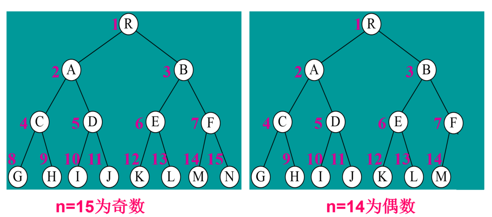

# 堆排序

## 完全二叉树

深度为h的完全二叉树：前h-1层为满二叉树，最后一层的节点必须从左向右连续出现，由于二叉树的性质，可以用连续的存储形式，即用数组存储每一个树节点

### 性质

对于具有n个节点的完全二叉树，如果按照从上至下，每层从左至右的次序，对节点进行编号，则编号为i的节点有以下性质：

* 若 `i < n / 2(向下取整)`，则编号为i的节点为分支节点，否则是叶子节点

* 若n为奇数，则树中每个分支节点既有左孩子又有右孩子

* 若n为偶数，则编号最大的分支节点（编号为n / 2）只有左孩子，没有右孩子，**注意此时编号从1开始**

  

* 若编号为i的节点有左孩子，则左孩子的编号为2i，右节点为2i + 1
* 除数根节点外，若一个节点的编号为i，则它的双亲节点的编号为`i/2(向下取整)`

### 以数组形式存储

数组下标是从0开始的，

* 下标为i的节点，左孩子节点下标为 2* i + 1，右孩子节点下标为 2 * i + 2
* 下标为i的节点，其父母节点下标为 `(i - 1) / 2(向下取整)`

## 什么是堆

堆是一颗二叉树，并满足下列条件

* 树的形状：完全二叉树
* 父母优势：每个节点的健都要大于或等于它子女的健

## 如何构造堆

构建大顶堆，将数组构建为大顶堆，数组长度为len

* 初始化堆

  将数组按序填充到堆中的各个节点，实际上直接用数组就好了

* 检查父母优势条件
  * 按照自下而上，从左至右的顺序（最后的父母节点开始，到根节点为止），即从`Math.floor((len - 1) / 2)`开始检查父母优势条件，即判断父节点与子节点的大小
  * 如果不满足则调换父子节点的位置
  * 当调换之后，要判断是否会对下层节点产生影响，如果此时交换了父子节点的值，那就要判断以子节点为根节点的堆是否满足父母优势（递归）

### 复杂度分析

* 最坏情况下，每个位于树的第i层的键都会移动到叶子层h中（h为树的高度）
* 移动到下一层需要2次比较
* 位于第i层的一个键移到叶子层h需要 2 * (h - i) 次比较

### 删除堆顶元素

